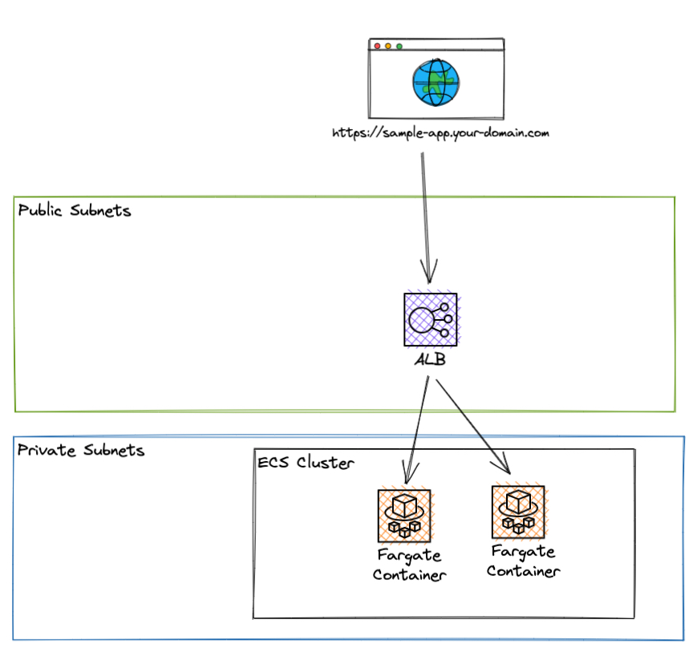
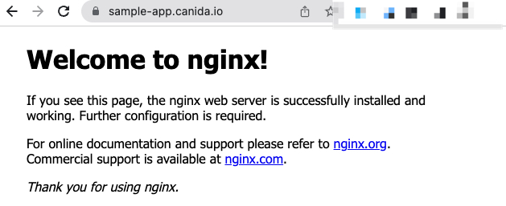

# ECS Quickstart with Terraform
This quickstart guide helps you to quickly run your application on AWS. For startups/smaller projects the setup is production ready. All the required resources can be created in a single command by using Terraform. The final setup is depicted below.

<p align="center">

</p>

## What you will get.
- An application that runs on https://sample-app.your-domain.com.
- Scaleable and reliable hosting of your app.
- TLS encryption i.e. https works. 
- Low price setup because it utilizes Spot instances (TODO add costs).

## What you need to bring.
- A dockerized application.
- Terraform Installation
- AWS CLI v2 Installation
- A domain on AWS
    - Alternatively, you can also just create a DNS zone delegation to manage subdomain.your-domain.com via AWS while leaving your-domain.com at your previous DNS provider.

## Quickstart.

### Adapt configuration values.
Check out [sample-app.tfvars](sample-app.tfvars) and modify the variables to serve your needs. The variables are also explained in [variables.tf](variables.tf).

### Initialize Terraform
```
terraform init
```

### Deploy Application

Run `terraform apply` to deploy this setup. Terraform will display the resources that will be created and you can confirm the changes. Creating the resources on AWS takes some time ~10 minutes.

```
terraform apply --var-file sample-app.tfvars
```

### Verify Setup
Visit [sample-app.your-domain.com]() to verify that the setup worked. If you deployed the nginx image. It should look as follows:
<p align="center">

</p>

## Extending the Setup

### Multiple Apps
You can use Terraform workspaces to manage multiple apps via this terraform module. Let's say you want to manage `sample-app1` and `sample-app2`. You can create workspaces for each app as follows:

```
terraform workspace new sample-app1
terraform workspace new sample-app2
```

and switch to a workspace using `terraform workspace select sample-app1`.

### Multiple apps in Same ECS Cluster
You can create a second ECS service to host another app. The load balancer costs ~20$ per month, therefore I recommend to share the load balancer between the apps.

### Database Access
I recommend to use a managed database database created by RDS. You can just configure the database url via an environment variable.

### Remote Backend
Remote backends enable you to store the Terraform state remotely instead of using this repository. This is useful because the state may contain secrets for example for your RDS database (in our case it doesn't). Additionally, you don't have to push your state which prevents inconsistencies for example if you forget to push the state and your colleague modifies the project.
In AWS you can use S3 to store the state. You can share the same bucket for multiple terraform projects. 

Create a bucket as follows:

```
aws s3api create-bucket --bucket my-terraform-bucket --region eu-central-1 --create-bucket-configuration LocationConstraint=eu-central-1
```

Then add the following snippet to `main.tf` to configure the remote backend.

```
terraform {
  backend "s3" {
    bucket = "my-terraform-bucket"
    key    = "app.tfstate"
    region = "eu-central-1"
  }
}
```

Then, execute `tf init --migrate-state` to migrate your state to the s3 backend.

## Additional Information

### Official AWS Quickstart Guide

AWS provides their own quickstart. However, I did not like the quality. That's why I created this setup. Check it out here: [https://github.com/aws-quickstart/terraform-aws-ecs-fargate](https://github.com/aws-quickstart/terraform-aws-ecs-fargate)


### Spot Instance Reliability
If you enable multi-az in the configuration. The app will be deployed across 2 availability zones. I.e. you won't have any downtime even if AWS kills one of your spot instances. The setup will just start another instance and in the meantime traffic is routed to your other replica only. The probability of your spot instance to get killed is <10% for a whole month. For many instances its < 5%. Check out information for specific instance types here: https://aws.amazon.com/ec2/spot/instance-advisor/

## Canida Internal Configuration Management

We use 1password to store the configuration files for Terraform.

### Create new application
*Note: 1Password allows you to create the same configuration multiple times. If that happens you will have to delete one version o.w. updating the config will fail.*

```
MYAPP=sample-app
op document create --vault demo-apps config/${MYAPP}.tfvars
terraform apply --var-file ${MYAPP}.tfvars
```

### Update application

First, retrieve the latest app configuration.

```
MYAPP=sample-app
op document get --vault demo-apps ${MYAPP}.tfvars > config/${MYAPP}.tfvars
```

Then, edit the config file locally, update the documents in 1password and apply the changes via Terraform.

```
op document edit --vault demo-apps ${MYAPP}.tfvars  config/${MYAPP}.tfvars
terraform apply --var-file ${MYAPP}.tfvars
```
